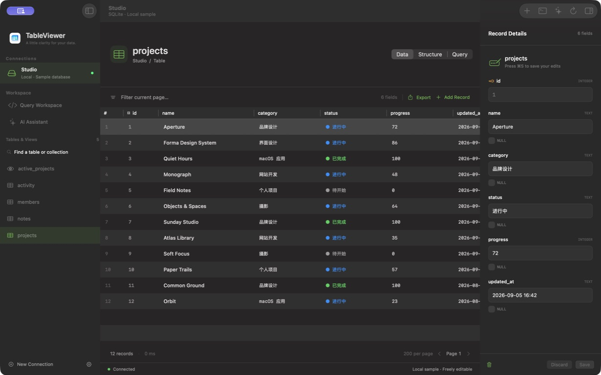

# TableViewer

English | [简体中文](README.zh-CN.md)

A native, open-source macOS workspace for **SQLite, PostgreSQL, and MongoDB**. Built with SwiftUI and AppKit, with English and Simplified Chinese interfaces.



[Download](https://github.com/Kamisato-Yuna/TableViewer/releases) · [Discussions](https://github.com/Kamisato-Yuna/TableViewer/discussions) · [Report a bug](https://github.com/Kamisato-Yuna/TableViewer/issues)

## Install

Download the macOS arm64 ZIP from Releases, unzip it, and move `TableViewer.app` to Applications. The public release is signed with Developer ID, notarized by Apple, and has its notarization ticket stapled.

Requires an **Apple Silicon Mac with macOS 26 or later**. The current release was built and tested on macOS 27 beta with Xcode 27 beta 6; macOS 26 runtime compatibility remains unverified. Intel builds are not provided. App Store China materials are prepared, but the app has not been submitted or listed while the current toolchain remains beta.

The app follows your system language. To override it, choose **Settings → Language**, save your work, and quit and reopen the app. Database content, identifiers, and user input are displayed unchanged.

## Features

- Browse tables, views, collections, and schemas. Sort columns, filter the current 200-row page, and export loaded results to CSV.
- Edit records with primary keys, including composite keys. Updates use parameter binding and conflict checks. Views, generated fields, and SQLite BLOB fields are read-only in the inspector.
- Edit MongoDB Extended JSON while preserving BSON types. `_id` is immutable; changed top-level fields use `$set` / `$unset`.
- Run one SQL statement or a MongoDB JSON command at a time. Queries display up to 1,000 rows or the first document batch.
- Inspect MongoDB replica-set topology, member health, and replication lag. Missing permissions fall back to topology from `hello`.
- Use a built-in JavaScriptCore shell with common CRUD, aggregation, variables, cursors, and `rs.status()`. This is a mongosh-style subset without Node.js, npm, filesystem, or OS shell APIs.
- Optionally connect your own OpenAI-compatible API. Every proposed database operation needs approval; results stay local until you explicitly send them back to the model.

An editable **Studio** SQLite sample opens on first launch. No external account is needed to explore the sample.

## Data and credentials

App Sandbox is enabled. SQLite files and their folders are authorized through system file pickers, with security-scoped bookmarks for reconnecting. Connection configuration lives in the app's local container. Database passwords, MongoDB URIs, and AI API keys live in macOS Keychain.

SQL and shell write commands act directly on the selected database. Stopping a query or shell does not undo completed writes. A timeout can leave a write outcome uncertain; reconnect and inspect the data before repeating it.

The optional AI assistant sends messages, conversation history, and connection name/database type to the provider you configure. Schema sharing and sending query results require separate choices. There is no maintainer-operated telemetry, advertising, or account service. Read the [privacy policy](docs/privacy.md).

## Develop

Use an Apple Silicon Mac, Homebrew, and Xcode with the macOS 26 SDK or later. The verified toolchain is Xcode 27 beta 6 (27A5252f); stable Xcode builds need separate verification.

```sh
brew install libpq mongo-c-driver
python3 script/bootstrap_drivers.py
./script/build_and_run.sh --build
```

Open `TableViewer.xcodeproj` in Xcode and run the TableViewer scheme. Debug uses ad hoc signing, so contributors do not need the maintainer's Apple account. Driver libraries are copied into `.build/` and embedded in the app; users do not need `psql`, `mongosh`, or Homebrew at runtime. The current bootstrap expects MongoDB C Driver 2.5.2 and an arm64 Tahoe bottle.

```sh
./script/test_databases.sh
./script/test_reliability.sh
python3 script/check_localizations.py
# Docker required; creates and removes disposable fixtures:
python3 script/test_features.py
```

See [CONTRIBUTING](CONTRIBUTING.md), [release instructions](docs/releasing.md), and [validation scope](docs/testing.md). GitHub Actions checks source syntax and translation resources; it does not replace macOS runtime or signing tests.

## Scope

No SSH tunnels, SQL autocomplete, parallel connection tabs, CSV import, or visual table designer. Replica lag reflects heartbeat snapshots. AI protocol tests use a local mock service and do not certify any real provider. Shell stops and timeouts terminate the worker, but do not roll back completed database writes.

## License and community

TableViewer source and original artwork are under the [MIT License](LICENSE). Bundled PostgreSQL, MongoDB C Driver, OpenSSL, Kerberos, and Zstandard components retain their original licenses in [ThirdPartyNotices](TableViewer/Resources/ThirdPartyNotices).

Chinese and English issues, discussions, and pull requests are welcome. Please read the [community expectations](CODE_OF_CONDUCT.md) and report sensitive vulnerabilities through [private security reporting](SECURITY.md).
