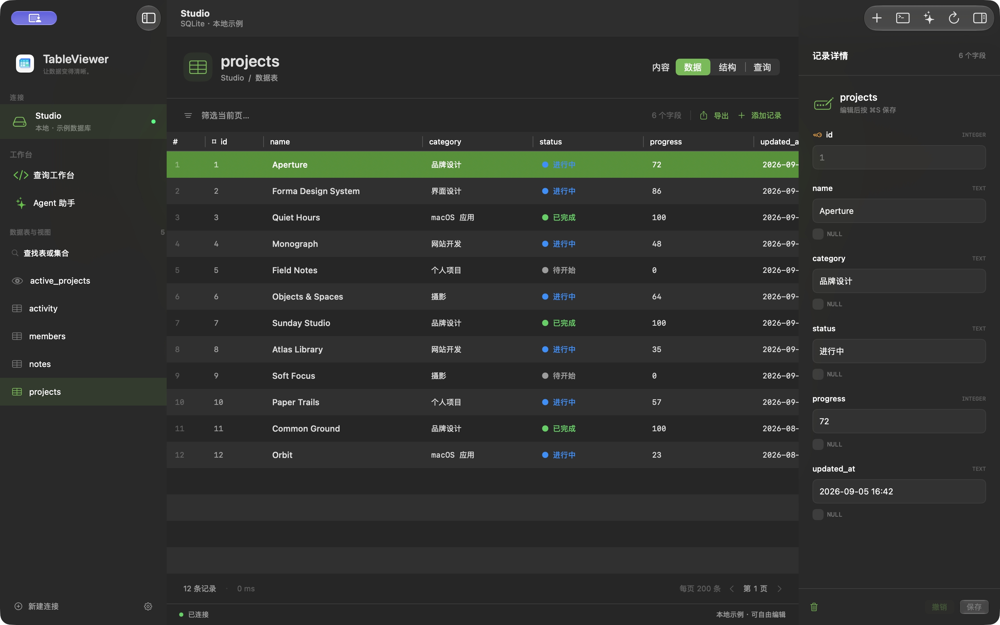

# TableViewer

[English](README.md) | 简体中文

开源的原生 macOS 数据库工作台。SwiftUI + AppKit，支持 **SQLite、PostgreSQL、MongoDB**。代码采用 MIT 许可，第三方依赖保留各自许可。



[下载安装包](https://github.com/Kamisato-Yuna/TableViewer/releases) · [交流讨论](https://github.com/Kamisato-Yuna/TableViewer/discussions) · [问题反馈](https://github.com/Kamisato-Yuna/TableViewer/issues)

支持英文和简体中文，默认跟随系统；在“设置 → 语言 / Language”选择语言，保存当前工作并重新启动后生效。数据库内容、对象名和用户输入保持原文。

## 打开应用

- 从 Releases 下载 ZIP，解压后将 `TableViewer.app` 移入“应用程序”并打开。开发者本地包位于 `dist/TableViewer.app`。应用已包含三个数据库驱动，运行时无需安装 `psql` 或 `mongosh`。
- 开发：用 Xcode 打开 `TableViewer.xcodeproj`，选择 **TableViewer → My Mac**，按 ⌘R。
- 命令行：`./script/build_and_run.sh`。Codex 的 **Run** 按钮也调用同一个脚本。
- 需要 Apple Silicon Mac，最低部署版本 macOS 26；已在 macOS 27 beta 上验证，macOS 26 运行兼容性尚未验证，当前不提供 Intel 版本。

首次启动会打开真实的 SQLite 示例数据库 **Studio**。示例内容可以自由编辑，不会连接其他已有数据库。

## 核心操作

1. **新建连接（⌘N）**：SQLite 选择或新建文件；PostgreSQL 填主机、端口、库名、用户和密码；MongoDB 填 URI 与操作库名。可以先测试再保存。
2. **浏览**：左侧选择表、视图或集合。每页 200 条，点击列标题排序；筛选框只筛选当前页。
3. **编辑**：选择记录，在右侧修改字段，点击保存或按 **⌘S**。保存前可以撤销。SQL 表需要主键，支持复合主键；视图、生成字段和 SQLite BLOB 字段在详情面板只读。主键不允许直接修改。
4. **MongoDB 文档**：使用 Extended JSON 编辑，保留 ObjectId、Int64、Decimal128、日期等 BSON 类型。保存只写入有变化的顶层字段，删除字段使用 `$unset`。`_id` 不可修改；带点号或以 `$` 开头的字段请通过命令编辑。
5. **查询**：SQL 每次执行一条语句，**⌘↵** 运行。MongoDB 输入 JSON 命令，命令名必须是第一个字段。查询历史只保留在当前连接的内存中。
6. **导出**：CSV 导出当前页 / 当前查询的已加载结果，包含当前页筛选。NULL 导出为空字段，空字符串导出为 `""`。

SQL 示例：

```sql
SELECT name, progress
FROM projects
WHERE progress >= 70
ORDER BY progress DESC;
```

MongoDB 示例：

```json
{
  "find": "projects",
  "filter": {"status": "active"},
  "limit": 100
}
```

## MongoDB 副本集与终端

连接 MongoDB 后，工作台会出现 **副本集** 和 **MongoDB Shell**。

- 副本集面板显示成员、PRIMARY / SECONDARY / ARBITER、健康、复制延迟、Ping、同步来源、任期和多数派票数。支持手动刷新、每 10 秒刷新及原始状态。延迟来自主节点 optime 与心跳快照，不代表实时监控。
- 没有 `replSetGetStatus` 权限时，使用 `hello` 中的拓扑；缺失健康和延迟会显示未知。单机实例和 mongos 会明确标注。
- URI 可包含 `replicaSet=名称`、多个种子节点和认证参数。客户端必须能解析并访问服务器公布的成员地址；`directConnection=true` 可只连接一个可达节点查看其状态。
- Shell 支持 JavaScript 变量、历史、`use`、`show collections`、`show dbs`、`rs.status()`、`rs.conf()`、常用 CRUD、聚合以及 `db.runCommand()`。Enter 执行，Shift+Enter 换行，上下键切换历史。
- 查询游标每次显示 20 条，输入 `it` 继续，单个游标最多读取 1,000 条。支持 ObjectId、NumberLong、NumberDecimal 和 ISODate。
- Shell 在独立子进程中执行，支持停止和重置，单次请求最多约 25 秒。**停止不会撤销已执行的写入**。变量、历史和会话只保留在内存中；切换连接会重置。Shell 中的 `use` 只改变终端的操作库。

```javascript
let active = db.projects.find({status: 'active'}).sort({name: 1})
active
it
rs.status().members.map(m => ({name: m.name, role: m.stateStr}))
```

这是内置 JavaScriptCore + 原生 MongoDB 驱动的 mongosh 风格终端，覆盖常用数据库交互；不包含完整 mongosh / Node.js 环境，没有 npm、文件系统、系统命令或 mongosh 专属模块。

## Agent 助手

在 **Agent 助手 → API 设置** 填入 Base URL、模型和 API Key。兼容 Chat Completions `/chat/completions`，支持 SSE 流式回复、工具调用和非流式服务。可通过 `/models` 测试并选择模型，也可直接填写模型 ID。本地免认证服务可以不填 Key。

- 对话默认仅发送你的消息、对话历史和当前连接名称/数据库类型。可选“附带当前表结构”；不会自动附带记录或数据库凭据。
- 模型可以提出 `inspect_schema` 和 `execute_query`。界面展示目标连接、目的和完整 SQL / MongoDB JSON 命令，**每个操作由你确认执行一次**，也可以拒绝。
- 执行结果先留在本机供查看；点击 **发送结果并继续** 才发回模型。最多发送 100 行和 24,000 字符，超出会标注截断。
- 切换连接、新建对话或保存 API 配置会清除会话和待执行操作。API Key 存储于 macOS 钥匙串；配置存储于应用偏好设置。
- 默认要求 HTTPS；本机回环 HTTP 可直接使用，可信内网 HTTP 需要显式开启。禁止携带凭据的 URL 和重定向转发 Key。

API 服务需要支持函数工具调用，才能产生可执行操作卡。仅支持文本的模型仍可帮助解释或编写查询。当前未提供无人值守执行、系统 Shell 工具或跨连接操作。

## 数据与连接

- 连接名称、文件路径、文件授权书签、主机等配置：应用沙盒容器内的 `Library/Application Support/TableViewer/connections.json`，通常为 `~/Library/Containers/local.yuna.TableViewer/Data/Library/Application Support/TableViewer/connections.json`。
- PostgreSQL 密码、完整 MongoDB URI：macOS 钥匙串，服务名 `local.yuna.TableViewer.connections`。不会写入连接 JSON、工程或日志。
- 示例库：同一沙盒应用支持目录中的 `Studio.sqlite`。
- SQLite 文件通过系统文件选择器授权，还需授权其所在文件夹以读写 WAL、SHM 和事务日志。连接保存文件与目录的安全作用域书签，重连时恢复授权；授权失效时需要重新选择文件及文件夹。旧的非沙盒版本配置仍保留在 `~/Library/Application Support/TableViewer/`，不会自动导入新容器；可重新创建连接并选择原数据库文件。
- 网络连接支持驱动原生认证和 TLS。PostgreSQL 提供 TLS 模式选择；MongoDB 支持 `mongodb://`、`mongodb+srv://` 及 URI 中的 TLS、认证源、副本集等选项。
- 记录修改使用参数绑定、完整主键和事务；更新会检查所改字段的原始值，冲突时要求刷新。MongoDB 采用原子条件更新，保留未改动字段。
- 查询编辑器的写入语句直接执行。SQL 中显式打开的事务由你用 `COMMIT` / `ROLLBACK` 结束；连接断开时未提交的 SQL 事务由驱动/数据库回滚。
- 退出时若有未保存的记录修改或进行中的数据库操作，会先显示提醒。写入成功但刷新失败时会明确说明已写入，避免重复提交。

## 当前范围

这是一版聚焦个人常用流程的应用。已提供数据库连接、表/集合浏览、结构查看、记录增删改、查询和 CSV 导出。当前未提供 SSH 隧道、SQL 自动补全、多连接并行标签、CSV 导入、可视化建表或完整 TablePlus 功能集；这些操作中的数据库管理部分仍可通过查询编辑器执行。

SQL 查询最多展示 1,000 行，MongoDB 原始命令展示首批文档；超出时界面会提示。SQLite 只读查询收满结果后停止扫描；带 RETURNING 的写入仍完整执行。SQL 查询不会擅自为你改写语句。SQLite 查询和 PostgreSQL 服务端默认超时约 15 秒，PostgreSQL 另有约 20 秒的客户端响应超时；客户端超时会断开连接，写入结果需要重连核对。COPY 不受支持，执行时会断开连接并明确提示。MongoDB 连接选择约 8 秒、socket 超时约 15 秒。网络调用在独立 actor 上串行执行。

已验证本地 SQLite、PostgreSQL 18.4 和 MongoDB 7.0，包含后两者的密码认证。新增的三节点 MongoDB 7.0 副本集已通过实际测试。未对你的远端实例、TLS 证书链、SRV 或真实 AI 服务进行验收。

## 开发与测试

```sh
# 构建并启动；--build 只构建，--verify 同时检查进程
./script/build_and_run.sh --verify

# SQLite 集成测试
./script/test_databases.sh

# 三种数据库，创建独立且有密码的 Docker 测试实例，结束后自动移除
python3 script/test_all_databases.py

# 副本集、Shell 和本地 OpenAI-compatible 协议检查
python3 script/test_features.py

# 本轮可靠性回归：大查询、重复列、失败恢复、退出保护
./script/test_reliability.sh

# 实际 App Sandbox 宿主中的副本集、Shell、API 和 SQLite 书签检查
python3 script/test_features.py --sandbox

# 为原生 UI 提供临时副本集和本地模拟 API，回车后清理
python3 script/test_features.py --ui
```

如果清除了 `.build/`，构建脚本会调用 `script/bootstrap_drivers.py`，从本机 Homebrew 的 libpq 和官方 Homebrew MongoDB C Driver bottle 准备驱动。该脚本仅在工程内复制并调整库路径，不修改全局安装。当前 MongoDB C Driver 版本为 2.5.2。

发布构建流程见 [发布说明](docs/releasing.md)，测试范围与结果见 [验证说明](docs/testing.md)。

界面使用系统 `NavigationSplitView`、工具栏、sheet 和 `glassEffect`，表格与代码编辑器通过 `NSViewRepresentable` 接入原生控件。支持系统深浅色、减少动态效果设置，以及详情栏的平滑过渡。

驱动参考：[PostgreSQL libpq](https://www.postgresql.org/docs/18/libpq.html)、[MongoDB C Driver](https://www.mongodb.com/docs/languages/c/c-driver/current/)。

图标源文件为 **`TableViewer/Resources/AppIcon.icon`**，可直接在 Xcode 27 自带的 Icon Composer 中编辑。新版“数据透镜”由多源背板、表格视窗、字段表头、记录和焦点单元格五个独立 SVG 玻璃层组成，突出表格浏览与记录聚焦，支持默认、深色和单色外观。Xcode 直接编译 `.icon` 为 `Assets.car` 及系统兼容图标，侧边栏和欢迎页也读取同一应用图标。运行 `./script/export_icons.sh` 可导出 Composer 原生外观、小尺寸及第 26 代预览；设计说明见 [Design/README.md](Design/README.md)。

MongoDB 状态参考：[replSetGetStatus](https://www.mongodb.com/docs/manual/reference/command/replSetGetStatus/)、[hello](https://www.mongodb.com/docs/manual/reference/command/hello/)。

## 开源参与

欢迎中文和英文 Issue / PR。[贡献指南](CONTRIBUTING.md)、[安全报告](SECURITY.md)、[隐私政策](docs/privacy.md)。CI 只做源码语法与翻译资源检查，macOS 构建和真实运行结果另行记录。
